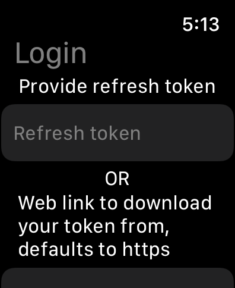
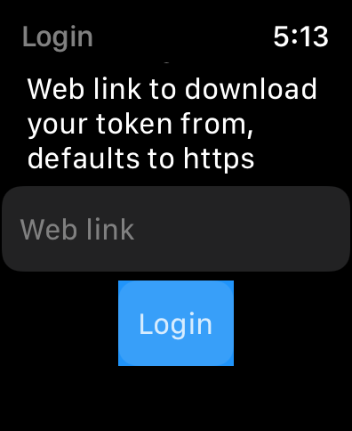
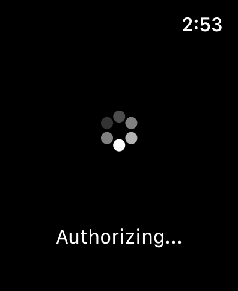

# wTesla - Watch app


**Created by: Ali Symeri (haha150)**

This project is a standalone Tesla app for the Apple watch with all the features that the official Tesla app has.

The app is still being developed to finish implementing all features that the official Tesla app has. It will continue to receive new features if requested and if Tesla adds additional features.

## Login

Currently, there are 2 ways to login either you provide your refresh token or you have to provide your full token to the app for it to download it and be able to use your account, the token has to be in a specific format, see below snippet:

```
{
  "access_token": "eyJaccess",
  "refresh_token": "eyJrefresh",
  "id_token": "id",
  "expires_in": 300,
  "token_type": "Bearer"
}
```

### Alternative 1: Steps to login with refresh token

1. Generate your token following [this](https://tesla-api.timdorr.com/api-basics/authentication)
2. Copy the refresh_token
3. Provide the refresh_token in the app login page, you only need to this one time
4. Enjoy

### Alternative 2: Steps to login with full token

1. Generate your token following [this](https://tesla-api.timdorr.com/api-basics/authentication)
2. Save it to a file
3. Host the file on a webserver/fileserver that the app can access
4. Provide the link to the token in the app login page, you only need to this one time
5. Enjoy

> The reason the app uses this way to login is due to Teslas authentication process, as soon as they provide a better way to authenticate using e.g. credentials, i will update the app.

## Current features

* Authorization with refresh token
* Authorization with full token
* List all vehicles
* Select specific vehicle
* Wake up vehicle
* View vehicle name
* View vehicle battery
* Lock/unlock vehicle
* Turn on/off HVAC
* Open frunk
* Open/close trunk
* Turn on/off sentry mode
* Open/close charging port
* Honk horn
* Flash lights
* Remote start
* Vent/close windows
* View climate
* Set climate temperature
* Defrost vehicle
* Turn on/off steering wheel heater
* View charging stats
* Set charging limit
* Start/stop charging
* Unlock charging port

## Feature request, bugs, questions or require assistance

Create a issue on [this](https://github.com/haha150/wTesla-IOS) github page.

## Donate

I will never ask for donations, however if you like the app and would like to help out, you can donate if you wish

[](https://www.paypal.com/donate/?business=88CWQTFPPYNJ4&no_recurring=1&item_name=Tesla+Apple+Watch&currency_code=EUR)

## Privacy Policy

See [Privacy Policy](https://haha150.github.io/wTesla/privacy) page.

## A note about security and privacy

This app accepts two types of login. Either Tesla API refresh token or a Tesla API token to be downloaded. Your API token is stored locally in the watch by default and used only to obtain/refresh an access token and refresh token directly from the Tesla API server. It is also only supplied once and then maintained by the app. It is preferable to supply a refresh token, as the app will then have a perpetual login. Your token will be persisted in the app. Tokens will be revoked if you change your Tesla account password. No network traffic will ever be emitted from this app that goes anywhere other than directly to the Tesla API servers or the initial authentication where you can specify where to download your token from.

## Disclaimer

This app is not endorsed by Tesla Inc. Use at your own risk. No guarantee of proper function is given. Only you are responsible for any changes to your vehicle caused by using this app.

## Some screenshots:

<p float="left">
    
    
    
    
    
    
    
    
    
    
    
    
</p>