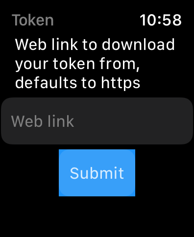

# wTesla - Watch app for Tesla


**Created by: Ali Symeri (haha150)**

This project is an EV app for Tesla for the Apple watch with all the features that the official Tesla app has.

The app is still being developed to finish implementing all features that the official Tesla app has. It will continue to receive new features if requested and if the Tesla app adds additional features.

You can purchase all features in the Watch app.

## Token

Currently, there are two ways to Authorize with the Tesla API in the app, either you generate it in the phone app and send it to the watch or you provide a download link to your token in the app for it to download it and be able to use your account, the token has to be in a specific format, see below snippet:

```
{
  "access_token": "eyJaccess",
  "refresh_token": "eyJrefresh",
  "id_token": "id",
  "expires_in": 300,
  "token_type": "Bearer"
}
```

> "refresh_token" is mandatory, the rest are optional. Effectively you are Authenticating towards Tesla API yourself (outside the app) and extracting your personal Token which you provide to the app for it to work for your account.

### Steps to generate and provide token to app

1. Generate your token following [this](https://tesla-api.timdorr.com/api-basics/authentication) guide
2. Save it to a file
3. Host the file on a webserver/fileserver that the app can access and download from
4. Provide the link to the token in the app Token page, you only need to this one time
5. Enjoy

> The reason the app uses this way to handle your Token is due to the Tesla authentication process, as soon as they provide a better way to authenticate and authorize using e.g. credentials, i will update the app.

## Current features

### Free features:
* Generate your Tesla token
* Send your Tesla token to Watch
* Download your Tesla token
* List all vehicles
* Select specific vehicle
* Wake up vehicle
* View vehicle name
* View vehicle battery
* Lock/unlock vehicle
* Turn on/off HVAC
* Open frunk

### In-app purchase - Additional features:
* Open/close trunk
* Turn on/off sentry mode
* Open/close charging port
* Honk horn
* Flash lights
* Remote start
* Vent/close windows
* View climate
* Set climate temperature
* Defrost vehicle
* Turn on/off steering wheel heater
* Turn on/off seat heaters
* Set climate mode
* View charging stats
* Set charging limit
* Start/stop charging
* Unlock charging port

## Feature request, bugs, questions or require assistance

Create an issue on [this](https://github.com/haha150/wT-IOS/issues) github page.

See [support](https://haha150.github.io/wTesla/support).

## Privacy Policy

See [Privacy Policy](https://haha150.github.io/wTesla/privacy) page.

## A note about security and privacy

This app accepts one type of Authorization. An API token to be downloaded. Your API token is stored locally in the watch by default and is only used to obtain/refresh an access token and refresh token directly from the EV API server. It is also only supplied once and then maintained by the app. It is preferable to supply a refresh token, as the app will then have a perpetual Authorization. Your token will be persisted in the watch. Tokens will be revoked if you change your EV account password. No network traffic will ever be emitted from this app that goes anywhere other than directly to the EV API servers or the initial Authorization where you can specify where to download your token from.

## Disclaimer

This app is not endorsed by any EV company. Use at your own risk. No guarantee of proper function is given. Only you are responsible for any changes to your vehicle caused by using this app.

## Some screenshots on watch:

<p float="left">
    
    
    
    
    
    
    
    
    
    
    
    
</p>

## Some screenshots on phone:

<p float="left">
    
    
    
</p>